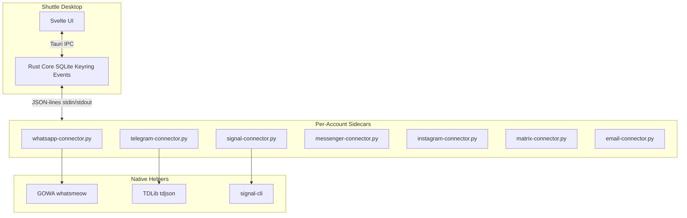
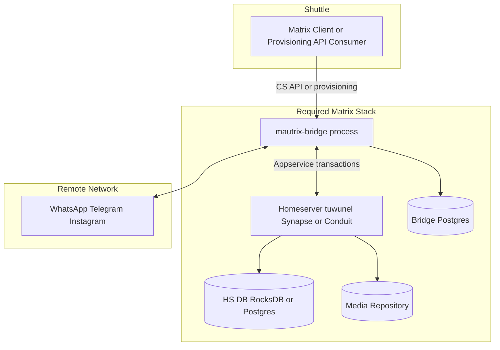

# Matrix / mautrix as a unified messaging layer for Shuttle

**Status:** architecture assessment — **closed; do not implement**  
**Dates:** researched 2026-08-18; revised 2026-08-19 after follow-up discussion  
**Scope:** desktop-primary Shuttle. Target load used for resource decisions: **5 WhatsApp + 1 Telegram + 1 Instagram** (assume 2+ accounts in production). SaaS is hypothetical only.  
**Verdict:** **Continue with native sidecars. Drop Matrix/mautrix bridges as Shuttle’s integration/transport layer.**

This document is a technical feasibility study. It does **not** authorize a rewrite, a homeserver in the desktop app, or a POC unless product goals change.

Sources: Shuttle repository, [mautrix](https://github.com/mautrix) org, [docs.mau.fi](https://docs.mau.fi/bridges/go/setup.html), mautrix-go Bridge v2 [provisioning OpenAPI](https://github.com/mautrix/go/blob/main/bridgev2/matrix/provisioning.yaml), [tuwunel](https://github.com/matrix-construct/tuwunel). Resource numbers are **estimates** unless marked as facts from upstream docs.

---

## 1. Executive summary

Shuttle is a **local-first Tauri desktop app** with a channel-agnostic sidecar protocol ([`shuttle-app/src-tauri/src/connectors/protocol.rs`](../shuttle-app/src-tauri/src/connectors/protocol.rs)). Each account is an isolated Python process speaking newline-delimited JSON to the Rust core. That already delivers “Connect → authenticate → account appears” without a Meta Developer account for WhatsApp.

Matrix/mautrix is **technically sound as a bridge platform**. It is **not** a better foundation for Shuttle than the architecture that already exists.

An early draft of this study recommended a **hybrid** (keep native WA/TG/Signal; use mautrix later for Discord/Slack). After evaluating tuwunel, a greenfield “start over” checkpoint, replacing SQLite with Postgres, and a real mix of **five WhatsApp lines plus Telegram and Instagram**, that hybrid is **not** the product path. Matrix would be a second product (a local mini-Beeper). Shuttle is a small local inbox.

**Decision**

- **Keep native:** WhatsApp (GOWA / whatsmeow), Telegram (TDLib), Signal (signal-cli), Email (IMAP/SMTP), Messenger (`fbchat`), Instagram (`instagrapi`)
- **Keep** the existing [`matrix-connector.py`](../connectors/matrix-connector.py) only as a **user-facing Matrix network** (login to a homeserver). That is not mautrix transport.
- **Do not** auto-install a homeserver (Synapse, Conduit, or tuwunel)
- **Do not** put Shuttle’s inbox on Postgres in order to use bridges
- **Do not** replace GOWA/TDLib/signal-cli with mautrix-* 
- **Do not** run a Matrix POC for core networks

**Note on “DBI”:** there is no DBI adapter in this repository. The catalog is WhatsApp, Telegram, Signal, Messenger, Instagram, Email, Matrix.

---

## 2. Why continue native and drop Matrix bridges

Shuttle already has the unification Matrix was supposed to provide: one Rust core, one JSON protocol, one inbox, helpers behind sidecars. Matrix would sit *under* that protocol and add a homeserver. It would not delete adapter work.

### What Matrix looked like it would buy

One Go style, one API, lazy-install bridges, tuwunel instead of Synapse, Postgres instead of SQLite, easier long-term features.

That is true only **after login**, and only for **Bridge v2**. It is not true for Discord (legacy), login UX, polls, calls, or disappearing messages. Shuttle would still map Matrix rooms into protocol v1.

### Why native wins

1. **The expensive part is not “three coding styles.”** WhatsApp, Telegram, and Signal already differ in auth and capabilities. mautrix does not make QR, `api_id`/`api_hash`, Signal linking, or Instagram cookies the same. You still build those UIs, plus tuwunel, appservice registration, portal rooms, and bridge upgrades.

2. **WhatsApp is the same protocol, then Matrix loses.** GOWA and mautrix-whatsapp both use whatsmeow. Five numbers is **one GOWA, five devices** ([`whatsapp-connector.py`](../connectors/whatsapp-connector.py) `POST /devices` against a shared `whatsapp.db`). That is the same shape as one mautrix process with five `UserLogin`s. Matrix adds a homeserver and extra media hops. It does not share WhatsApp session RAM.

3. **Telegram is not a wash.** TDLib is the official client library. mautrix-telegram is unofficial and still needs `api_id`/`api_hash`. Choosing Matrix means skipping the better backend.

4. **A homeserver is mandatory and always on.** No tuwunel/Synapse/Conduit → no bridges. Lazy bridges only skip *unused* networks. With 5 WhatsApp + 1 Telegram + 1 Instagram, you would run HS + DB + three bridges anyway.

5. **Tuwunel does not change the recommendation.** It is a better HS than Synapse for a private, federation-off embed (Rust, RocksDB, static binary, appservices). It is still an extra always-on process Shuttle does not need. It cannot host Shuttle’s inbox; it is not Postgres.

6. **SQLite is the right Shuttle store at this size.** Seven local accounts do not outgrow WAL SQLite. One Postgres with several databases is a *server* pattern. Even in a “all Postgres” Matrix design, tuwunel stays on RocksDB — you never get a single store. Desktop backup, shutdown, and zero-ops SQLite match Shuttle.

7. **Failure domain.** Native: one sidecar or GOWA device dies, the rest keep going. Matrix: tuwunel or Postgres down takes every account.

8. **“Enterprise Matrix” is the wrong kind of enterprise.** tuwunel/Synapse/Element are for Matrix chat. mautrix bridges are unofficial puppeting — same ToS/ban class as GOWA/instagrapi, not WhatsApp Cloud API or TDLib.

**Drop:** Matrix as an internal bus; auto-install a homeserver; moving the inbox to Postgres *in order to* use bridges; replacing GOWA/TDLib/signal-cli.

**Keep:** protocol v1, per-account sidecars, native helpers, SQLite, and `matrix-connector` only for people who actually use Matrix.

---

## 3. Current Shuttle architecture

```
Svelte UI  ←→  Tauri IPC  ←→  Rust core (SQLite, events, keyring)
                                    ↕ JSON-lines on stdin/stdout
         WhatsApp · Telegram · Signal · Messenger · Instagram · Matrix · Email
```



### Properties from the codebase

| Property | Implementation |
| --- | --- |
| Adapter interface | `ConnectorRequest` / `ConnectorResponse` / `ConnectorEvent` — protocol v1 |
| Process model | One sidecar process per account (`ConnectorManager::start_connector`) |
| WhatsApp multi-account | **One shared GOWA** process; each Shuttle account is a GOWA device |
| Auth flow | `authenticate` → `auth_required` (QR/phone/password) → `submit_auth` → `account.connected` |
| Persistence | `app.sqlite` catalog + per-account `inbox.sqlite` ([core.md](core.md)) |
| Secrets | OS keyring (`secrets.rs`); not in SQLite |
| Events handled | `message.received/sent`, `conversation.updated`, `contacts.synced`, `history.sync.*`, `media.downloaded`, `avatar.updated` |
| AI layer | Planned (roadmap track 8); events already go through `handle_connector_event` |
| Deployment | Desktop-only; lazy-download components from S3 ([platforms.md](platforms.md)) |

### Connector inventory

| ID | Backend | Auth UX | Status |
| --- | --- | --- | --- |
| `whatsapp` | GOWA (whatsmeow) | QR scan | Working — REST/WS on loopback; multi-device in one GOWA |
| `telegram` | TDLib | Phone + code + optional 2FA | Working — user supplies `api_id` / `api_hash` |
| `signal` | signal-cli JSON-RPC | Phone + SMS/captcha | Working — GPL sidecar |
| `messenger` | fbchat (unofficial) | Email + password | Working but brittle |
| `instagram` | instagrapi (unofficial) | Username + password + 2FA | Working but brittle |
| `matrix` | Matrix Client-Server API | Homeserver + password | Working — **Matrix as a network**, not mautrix |
| `email` | IMAP/SMTP stdlib | Address + password | Working |

Product principles ([overview.md](overview.md)): local-first, no Shuttle cloud, channel-agnostic core, credentials out of SQLite/WebView, unofficial APIs marked.

---

## 4. Current adapter analysis

Implemented requests: handshake, auth, send text, mark read, sync history/chat, download media, fetch avatar, create group, shutdown.

Events: conversations, messages, contacts, media, avatars.

**Not yet first-class in the protocol:** reactions, edits, deletes, typing, replies as requests, rich text, calls.

Sidecars already put extra types in message `metadata` JSON (WhatsApp stickers, polls, PTT). The UI preview layer understands those types in [`messageMedia.ts`](../shuttle-app/src/lib/messageMedia.ts).

### Strengths

- Direct path to networks — no intermediate event bus
- Fits desktop resource profile
- WhatsApp QR without Meta Cloud API
- Crash isolation (except five WhatsApp accounts share one GOWA — still better than one HS for all networks)
- License split already documented ([licensing.md](licensing.md))

### Weaknesses

- Each network reimplements auth, sync, and media
- Messenger/Instagram use unofficial libraries (the only native adapters that are clearly weaker than mautrix equivalents)
- No Discord/Slack yet ([roadmap.md](roadmap.md) track 9)
- Telegram still needs developer keys — mautrix does too
- Sidecars will not work unchanged on Android
- Five Python WhatsApp sidecars talking to one GOWA is extra RAM; that is a Shuttle wrapper choice, not a reason to take Matrix

---

## 5. Matrix / mautrix architecture (evaluated, not adopted)

```
                         SHUTTLE
                            │
                      Matrix Client/API
                            │
                      Matrix Homeserver
                            │
         ┌──────────────────┼──────────────────┐
         ▼                  ▼                  ▼
  mautrix-whatsapp   mautrix-telegram   mautrix-instagram
         │                  │                  │
         ▼                  ▼                  ▼
     WhatsApp           Telegram            Instagram
```

A homeserver is **mandatory**. Bridges are Application Services. You cannot skip this.



### Facts from upstream (as of 2026-08-18)

| Fact | Source |
| --- | --- |
| Homeserver is mandatory | [docs.mau.fi/bridges/go/setup.html](https://docs.mau.fi/bridges/go/setup.html) |
| Synapse recommended; Conduit-family supported (continuwuity, tuwunel lineage); **Dendrite not supported** | Official bridge setup docs |
| Bridges are Application Services | Matrix AS architecture |
| Bridge v2 in mautrix-go; WhatsApp/Telegram/Signal/Meta/Slack/Instagram on v2; **Discord still legacy** | mautrix GitHub, Aug 2026 |
| Provisioning API at `/_matrix/provision/v3/*` | [provisioning.yaml](https://github.com/mautrix/go/blob/main/bridgev2/matrix/provisioning.yaml) |
| Multi-login: one Matrix user → many `UserLogin`s; one WhatsApp bridge → many WA accounts | bridgev2 `UserLogin` model |
| Exactly one bridge replica | Docker setup docs |
| mautrix-go is **MPL-2.0**; individual bridges are **AGPL-3.0** | GitHub LICENSE files |
| Coordinated release v26.08 (2026-08-16); mautrix-go v0.30.0 | GitHub releases |

### Do bridges share one API / schema?

**For Bridge v2 after login: mostly yes.** Same Go framework, same provisioning envelope, same Matrix events (`m.room.message`, rooms, `mxc://`).

**For “everything Matrix”: no.** Discord is legacy. Login steps differ (QR vs cookies vs `api_id` vs tokens). Features (polls, disappearing, buttons, calls) stay platform-specific.

### Capability mapping (why Matrix does not become Shuttle’s schema)

| Shuttle capability | Matrix equivalent | Bridge support | Limitation |
| --- | --- | --- | --- |
| Send / receive text | `m.room.message` | Good | Still mapped into protocol v1 |
| Media | `mxc://` | Good | Extra download/upload hop |
| Stickers / voice | Converted files | Partial | ffmpeg / LottieConverter |
| Reactions / edits / replies | `m.reaction`, `m.replace`, `m.relates_to` | Good on v2 | Shuttle protocol does not expose these yet — extend protocol v1 instead of taking a HS |
| Groups | Rooms | Good | Role models differ |
| Polls / buttons / disappearing | Poor | Weak | Stay native or degrade |
| Calls | None unified | Poor | Out of scope either way |

---

## 6. Tuwunel vs Synapse / Conduit

[Tuwunel](https://github.com/matrix-construct/tuwunel) is a Rust homeserver, official successor to conduwuit (Conduit fork). Single binary, RocksDB, static builds, Docker, packages. Federation: `allow_federation = false`. Appservices: `!admin appservices register` or TOML. mautrix treats Conduit-family servers as supported.

**If Shuttle ever embedded a private Matrix runtime, tuwunel would be the right HS** (not Synapse). That hypothetical does not justify embedding it.

| Question | Answer |
| --- | --- |
| Lighter than Synapse? | Yes |
| Federation-off local use? | Yes, supported |
| Puts Shuttle inbox in Postgres? | No — tuwunel is RocksDB |
| Removes the need for mautrix DBs? | No — bridges still want their own DB (Postgres recommended) |
| Changes WA/TG/Signal recommendation? | **No** |

Auto-installing tuwunel on every Shuttle install was considered and **rejected**: first-run `server_name`, DB path, admin user, appservice tokens, upgrades, shutdown vs keep-alive, backup of RocksDB + media.

---

## 7. Authentication and provisioning

| Network | Shuttle today | With mautrix | Developer account? |
| --- | --- | --- | --- |
| WhatsApp | QR via GOWA | QR via `display_and_wait` | **No** either way |
| Telegram | Phone + code via TDLib | Phone + code or QR | **`api_id`/`api_hash` still required** |
| Signal | Phone register/link | QR as secondary device | **No** |
| Messenger | Email + password | Cookies / messenger-lite | **No** |
| Instagram | Username + password | Cookies | **No** |

mautrix achieves “no Meta Developer account” for WhatsApp — **Shuttle already does this with GOWA**. Provisioning APIs would let Shuttle drive QR in-app; that is not a reason to add a HS.

---

## 8. Multi-account: 5 WhatsApp + 1 Telegram + 1 Instagram

This is the resource and architecture load used for the decision. Production is assumed to be **at least two accounts**; this mix is seven.

### Native (current)

```
Shuttle SQLite
 ├── 5× whatsapp-connector.py  →  1 GOWA process, 5 devices, one whatsapp.db
 ├── 1× telegram-connector.py  →  1 TDLib session
 └── 1× instagram-connector.py →  instagrapi
```

GOWA is shared (`load_or_start_gowa`). Five Python interpreters around it are Shuttle overhead, not GOWA’s.

### Matrix (rejected)

```
PostgreSQL instance
 ├── db shuttle              (if inbox moved off SQLite)
 ├── db mautrix_whatsapp
 ├── db mautrix_telegram
 └── db mautrix_instagram
tuwunel (RocksDB)            ← cannot live in Postgres
mautrix-whatsapp             ← 5 UserLogins, one process
mautrix-telegram             ← 1 login
mautrix-instagram            ← 1 login (separate binary since v26.07)
```

Lazy start of unused bridges does not help this mix: all three networks are in use, so HS + Postgres + three bridges stay up.

Moving Shuttle’s catalog/inboxes into the same Postgres (“trash SQLite”) is possible. It is the wrong trade for a single-user desktop at seven accounts. SQLite is not the bottleneck. You would still have RocksDB for tuwunel.

---

## 9. Resource estimates (your mix)

**No official mautrix per-account SLOs.** Idle, all seven connected, laptop.

### Native

| Process | Idle RAM (estimate) |
| --- | --- |
| 1 GOWA, 5 devices | 200–450 MB |
| 5 Python WhatsApp sidecars (current) | 100–200 MB |
| 1 TDLib | 80–200 MB |
| 1 instagrapi | 50–150 MB |
| Shuttle + SQLite | 50–150 MB |
| **Total extra** | **~500 MB–1.1 GB** |

Greenfield native without five Python wrappers (one WhatsApp sidecar + GOWA): drop ~100–200 MB.

### Matrix + tuwunel + Postgres (Shuttle inbox in Postgres)

| Process | Idle RAM (estimate) |
| --- | --- |
| PostgreSQL | 100–250 MB |
| tuwunel | 50–150 MB |
| mautrix-whatsapp (5 logins) | 200–450 MB |
| mautrix-telegram | 80–200 MB |
| mautrix-instagram | 80–200 MB |
| Shuttle | 50–150 MB |
| **Total extra** | **~550 MB–1.4 GB** |

Active / media-heavy: Matrix disk and bandwidth are worse (remote → bridge → HS media repo → Shuttle). Five WhatsApp accounts with years of media is where that hurts.

**Lighter: native.** The 1-account gap shrinks at five WhatsApp sessions (both sides pay whatsmeow). Postgres + tuwunel is still a floor native does not pay.

Latency (estimate): native Shuttle → GOWA ~50–200ms; Matrix Shuttle → HS → bridge → WhatsApp +100–500ms, media worse.

---

## 10. Greenfield: if WA / TG / Signal were not yet built

Even starting from zero, the choice for this product is **GOWA + TDLib + signal-cli + SQLite**, not tuwunel + mautrix + Postgres.

| Network | Greenfield native | Greenfield Matrix |
| --- | --- | --- |
| Telegram | **TDLib official** — decisive | Unofficial + same API keys |
| WhatsApp | GOWA / whatsmeow | Same protocol + HS |
| Signal | signal-cli (JVM is heavy) | Go bridge is a nicer *process*; still needs a phone + HS |
| Instagram | instagrapi | mautrix-instagram likely better **as a library**, not a reason to take the whole stack |

Matrix is the right greenfield bet only for a Beeper-class product (many unofficial networks, always-on server). That is not Shuttle.

---

## 11. AI / agent integration

All connector events already pass through `handle_connector_event` in [`connectors/mod.rs`](../shuttle-app/src-tauri/src/connectors/mod.rs). Planned AI (roadmap track 8) attaches there whether Matrix exists or not.

Matrix event IDs, rooms, and relations are a reasonable AI substrate. They are **not superior** to Shuttle SQLite + `remote_id` + `metadata`. Do not adopt Matrix to help AI. Extend protocol v1 for reactions/edits if needed.

---

## 12. Reliability and security

| Risk | Native | Matrix |
| --- | --- | --- |
| WhatsApp ~14-day phone-offline expiry | Same linked-device limit | Same |
| Process crash | One account / one GOWA | All accounts if HS or PG dies |
| Duplicates | `(conversation_id, remote_id)` | Need Matrix event ID dedup |
| Credentials | OS keyring + session dirs | Bridge DB + HS tokens + Postgres |
| Federation | N/A | Must disable for a private embed |
| Attack surface | GOWA on loopback | HS HTTP, appservice, provisioning |

If Matrix were deployed (it will not be): private non-federated tuwunel, loopback only, no public HS.

---

## 13. Licensing

Not legal advice.

| Component | License | Implication |
| --- | --- | --- |
| Shuttle | AGPL-3.0 | Current project license |
| mautrix bridges | AGPL-3.0 | Compatible with Shuttle; still extra compliance if bundled |
| mautrix-go | MPL-2.0 | File-level copyleft |
| GOWA / whatsmeow | MIT / MPL-2.0 | Permissive |
| TDLib | BSL-1.0 | Official Telegram library |
| signal-cli | GPL-3.0 | Already handled as a sidecar |
| tuwunel | Confirm `LICENSE` before any bundle | Conduit-lineage FOSS; not a reason to adopt |

Dropping mautrix as transport avoids bundling extra AGPL bridge binaries.

---

## 14. Native vs Matrix vs hybrid (final scores)

Hybrid (Option C) was the first-pass recommendation. It is **withdrawn** as the product path. Optional mautrix for a *future* network with no native library is not an architecture; it is a later connector decision.

| Integration | Current | Mautrix | Replace? | Keep native? | Reason |
| --- | --- | --- | --- | --- | --- |
| WhatsApp | GOWA | Yes (v2) | **No** | **Yes** | Same protocol; shared GOWA already multi-account |
| Telegram | TDLib | Yes (v2) | **No** | **Yes** | Official library |
| Signal | signal-cli | Yes (v2) | **No** | **Yes** | Working; HS overhead |
| Messenger | fbchat | mautrix-meta | **No** | **Yes** | Unofficial both ways; do not take a HS for this |
| Instagram | instagrapi | mautrix-instagram | **No for now** | **Yes** | Weakest native adapter; fix/replace *that connector* if it breaks, not the whole stack |
| Discord | None | Legacy | **Not via Matrix bus** | N/A | If needed later, evaluate a native sidecar first |
| Slack | None | v2 | **Not via Matrix bus** | N/A | Same |
| Email | IMAP/SMTP | No | **No** | **Yes** | Irrelevant |
| Matrix (user network) | matrix-connector | N/A | **No** | **Yes** | Different use case |

Scores (1–10, higher is better) for **this product** at 5+1+1:

| Criteria | Native | Full Matrix | Hybrid (withdrawn) |
| ---: | ---: | ---: | ---: |
| Development effort (core 3 nets) | **8** | 5 | 6 |
| Runtime complexity | **8** | 3 | 5 |
| Resource usage | **8** | 4 | 5 |
| Reliability / isolation | **8** | 4 | 6 |
| Multi-account (5 WA) | **8** | 7 | 7 |
| Authentication UX | **8** | 7 | 7 |
| Feature coverage (TG especially) | **8** | 6 | 7 |
| AI integration | **7** | 7 | 7 |
| Desktop fit | **9** | 3 | 4 |
| Security surface | **8** | 4 | 5 |
| Licensing / ops | **8** | 5 | 5 |
| Long-term maintainability | **7** | 5 | 6 |

Native wins because Shuttle’s unified layer already exists and the Matrix tax is a homeserver, not a cleaner inbox.

---

## 15. Recommended architecture (stay the course)

```
                         SHUTTLE DESKTOP
                    (Tauri + Rust + SQLite)
                              │
                    Unified Connector Protocol v1
                              │
         ┌────────────────────┼────────────────────┐
         │                    │                    │
    Native sidecars      matrix-connector     (no mautrix bus)
    (per account)        (user Matrix HS)
         │                    │
    GOWA (5 WA devices)  matrix.org or other
    TDLib
    signal-cli
    fbchat / instagrapi
    IMAP/SMTP
```

1. Keep `ConnectorManager` and protocol v1
2. Keep SQLite (`app.sqlite` + per-account `inbox.sqlite`)
3. Keep one GOWA for all WhatsApp devices
4. Do not add tuwunel, Postgres, or mautrix processes
5. Improve native wrappers if needed (e.g. one WhatsApp sidecar for many devices) instead of inserting Matrix

**Message path (WhatsApp):** WhatsApp → GOWA WS → sidecar → Rust → SQLite → UI. Outbound is the reverse. Media: on-demand `DownloadMedia` into `SHUTTLE_FILES_DIR`.

---

## 16. Migration / POC

**None.** Do not stand up Conduit/tuwunel, do not prototype `matrix-bridge-connector.py`, do not dual-run GOWA vs mautrix-whatsapp as a product track.

If Instagram becomes unusable, evaluate replacing **only** `instagram-connector.py` (including mautrix-instagram as one candidate among others). That evaluation must not imply a homeserver for WhatsApp/Telegram.

If Discord or Slack is scheduled as a product network, write a native sidecar or pick a library; do not introduce a Matrix runtime “while we are at it.”

---

## 17. Risks of *not* using Matrix (accepted)

| Risk | Mitigation |
| --- | --- |
| Per-network connector maintenance | Accept; protocol v1 already isolates the UI |
| instagrapi / fbchat breakage | Mark unofficial; replace that sidecar if needed |
| Discord/Slack slower to add | Roadmap track 9; one sidecar each when demanded |
| Signal-cli JVM weight | Known; still cheaper than HS+PG+bridge for the whole app |
| Mobile later | Sidecars were already a problem; Matrix would not have solved Android process model cleanly |

---

## 18. Open questions (not blocking; not a POC)

These remain unknowns and **do not** reopen the architecture:

1. Exact RSS of GOWA with five live devices on this machine
2. Whether collapsing five WhatsApp Python sidecars into one process is worth a small native refactor
3. instagrapi longevity vs other unofficial IG clients (without a HS)

---

## 19. Final recommendation

> **Should Shuttle adopt Matrix/mautrix as its internal messaging integration layer, partially adopt it, or continue with native adapters?**

**Continue with the current native adapter architecture. Drop Matrix/mautrix as the integration layer.**

- Keep GOWA, TDLib, signal-cli, IMAP/SMTP, and the unofficial Meta sidecars
- Keep SQLite
- Keep `matrix-connector` for Matrix-the-network only
- Do not embed tuwunel/Synapse/Conduit
- Do not move the inbox to Postgres to enable bridges
- Do not treat Bridge v2 sameness as a reason to rewrite working WhatsApp/Telegram paths

Matrix is a valuable bridge ecosystem for people who already run a homeserver. It is not a simplification of Shuttle.
