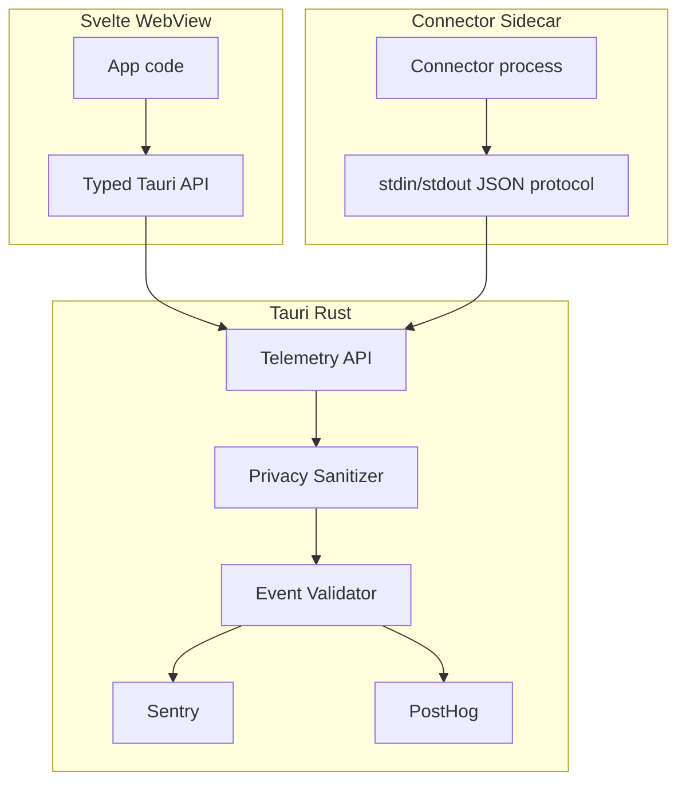

# Shuttle Telemetry Implementation Plan (Privacy-First)

> **Status (0.0.9–0.1.0):** implemented. Day-to-day contract, event names, cadence, and env vars are in [telemetry-events.md](telemetry-events.md). This file is the original design (sanitizer rules, module layout, phased work). Prefer the events doc unless you are changing telemetry architecture.

## Purpose

This document defines a complete implementation plan for privacy-first observability in Shuttle using:

- Sentry for crash/error/performance diagnostics
- PostHog for anonymous product analytics

The application handles private messaging data, so telemetry must never include message content, contact identity, account identifiers, credentials, tokens, or other user-identifying messaging data.

## Scope and Non-Goals

### In Scope

- Centralized telemetry abstraction in Rust and frontend code
- Consent-gated telemetry (independent crash and usage toggles)
- Strict allowlist-based sanitizer and validation
- Anonymous installation identity (non-personal, random UUID)
- Connector sidecar telemetry forwarding through Tauri
- Performance and reliability instrumentation
- Automated privacy tests and failure-isolation tests
- Environment-separated configuration (dev/staging/prod)

### Out of Scope

- Session replay, screenshots, keystroke capture
- Direct app-wide calls to Sentry/PostHog SDKs outside telemetry modules
- OpenTelemetry adoption
- Dedicated local telemetry databases (`sentry.sqlite`, `posthog.sqlite`)

## Storage Architecture

Shuttle uses multiple SQLite databases but no telemetry databases.

| Database | Purpose |
|---|---|
| `app.sqlite` | App catalog data, app settings, installation identity |
| `accounts/<account_id>/inbox.sqlite` | Per-account message/conversation data |
| *(none)* | Sentry/PostHog event persistence |

### App-Level Settings and Identity in `app.sqlite`

Add metadata/settings tables:

```sql
CREATE TABLE IF NOT EXISTS app_meta (
  key TEXT PRIMARY KEY,
  value TEXT NOT NULL
);

CREATE TABLE IF NOT EXISTS app_settings (
  key TEXT PRIMARY KEY,
  value TEXT NOT NULL
);
```

Planned keys:

- `app_meta.installation_id` (UUIDv4)
- `app_meta.installation_created_at` (ISO8601 UTC)
- `app_settings.config` (JSON serialized `AppConfig`)

### Migration Plan

1. On startup, if `catalog.sqlite` exists and `app.sqlite` does not, rename `catalog.sqlite` (+ WAL/SHM) to `app.sqlite`.
2. Run catalog migrations adding `app_meta` and `app_settings`.
3. If `config.json` exists and `app_settings.config` is missing, import config JSON into DB.
4. If `installation_id` is absent, generate UUIDv4 and store it.
5. Keep `config.json` temporarily for backward backup compatibility; deprecate later.

## Consent and Privacy Controls

Settings path:

- `Settings` -> `Privacy` -> `Anonymous Diagnostics`

Two independent toggles:

- Send anonymous crash reports (`crash_reports`)
- Send anonymous usage and performance diagnostics (`usage_diagnostics`)

Behavior:

- `crash_reports = false` -> Sentry disabled
- `usage_diagnostics = false` -> PostHog disabled and performance sampler paused
- toggles must apply at runtime without restart when feasible

## Telemetry Flow and Trust Boundaries



Rules:

- WebView code should not call Sentry/PostHog directly outside the telemetry module.
- Connectors cannot send arbitrary telemetry payloads to vendors.
- All telemetry passes sanitizer + validator in Rust.

## Module Layout

### Frontend

- `src/lib/telemetry/index.ts`
- `src/lib/telemetry/events.ts`
- `src/lib/telemetry/privacy.ts`
- `src/lib/telemetry/types.ts`

### Rust

- `src-tauri/src/telemetry/mod.rs`
- `src-tauri/src/telemetry/events.rs`
- `src-tauri/src/telemetry/privacy.rs`
- `src-tauri/src/telemetry/system.rs`
- `src-tauri/src/telemetry/performance.rs`

## Typed Event Registry

Implement an explicit event registry. No generic free-form telemetry API.

Examples:

- `app_started`, `app_ready`, `app_closed`
- `onboarding_started`, `onboarding_completed`
- `account_add_completed`, `account_add_failed`, `account_removed`
- `connector_sync_started`, `connector_sync_completed`, `connector_sync_failed`, `connector_crashed`
- `database_initialized`, `database_migration_completed`, `database_error`
- `performance_snapshot`

Each event has a strict property allowlist. Unknown properties are rejected or stripped.

## Privacy Sanitization Policy

### Denylist Detection

Reject/scrub keys and values indicating:

- phone numbers, emails, usernames
- chat/account/message IDs
- message text/content
- auth/session tokens, cookies, passwords, API keys
- authorization headers, QR auth payloads

### URL Sanitization

- Strip query parameters for sensitive keys
- Normalize user-specific path segments (e.g. `/account/{id}/chat/{id}`)
- Avoid sending raw URLs if they can contain identifiers

### Global Allowed Context

- `app_version`, `build_channel`, `release`, `git_commit`
- `os`, `os_version`, `architecture`
- `cpu_core_count`, `ram_bucket`
- `accounts_total`, `connector_count`
- `database_size_bucket`, `message_count_bucket`

Forbidden:

- hostname, OS username, home directory path
- IP/MAC, machine serials, machine UUID

## Telemetry Cadence and Resource Budget

Design goal: useful diagnostics with negligible overhead and strict privacy.

### Cadence

| Type | Collection | Send |
|---|---|---|
| Sentry errors/crashes | on failure | immediate (SDK may batch) |
| PostHog product events | on action | batched (about every 30s) |
| Sentry traces | on major operation | sampled (10%) |
| Performance snapshots | periodic local sampling | 15m foreground / 30m background |

### Performance Sampling

- Foreground sample interval: **60 seconds**
- Background sample interval: **180 seconds**
- Foreground snapshot send interval: **15 minutes**
- Background snapshot send interval: **30 minutes**

State behavior:

- focus/visible -> foreground sampling rules
- blur/minimized/hidden -> background sampling rules
- on state change, reset buffer and switch cadence
- when diagnostics disabled, sampler sleeps

Sampling implementation notes:

- single Tokio task
- bounded ring buffer (fixed size)
- compute `avg` and `p95` on snapshot emit
- no local telemetry database

## Sentry Integration Plan

### Rust

- Initialize Sentry only if `crash_reports` is enabled
- Enable panic capture and error capture
- Add `before_send` sanitizer hook
- Set release metadata (`shuttle@x.y.z`, commit, channel)
- Set trace sampling rate (`traces_sample_rate = 0.1`)
- Keep profiling/session replay disabled

### Frontend

- Initialize Sentry browser SDK from telemetry module only
- Capture unhandled exceptions/rejections
- Sanitize every payload via `beforeSend`
- Disable data capture features that risk user content leakage

## PostHog Integration Plan

- Initialize only if `usage_diagnostics` is enabled
- Use `installation_id` as `distinct_id`
- Do not call `identify()` with personal/account identifiers
- Disable autocapture and recording features
- Use sanitizer/allowlist before each track call
- Keep bounded in-memory queue and safe drop policy

## Connector Telemetry Contract

Connector events sent to Shuttle host over JSON protocol:

```json
{
  "type": "telemetry",
  "event": "sync_completed",
  "connector_type": "telegram",
  "duration_ms": 3821,
  "items_processed": 1421,
  "errors": 0
}
```

Host validates:

- event name in connector-allowed set
- connector type allowed
- numeric fields range-safe
- no additional unsafe fields

Only validated data can be forwarded to Sentry/PostHog.

## App API Surface (Developer-Facing)

Expose typed functions:

- `telemetry.track(eventName, props)`
- `telemetry.performance(operation, props)`
- `telemetry.error(error, context)`

Application code should not know which backend receives each event.

## Configuration and Environments

Use build/runtime config:

- `SENTRY_DSN`
- `POSTHOG_API_KEY`
- `POSTHOG_HOST`
- `SHUTTLE_BUILD_CHANNEL` (`testing` locally, `production` on `main` / tags)

Environment separation:

- development (off or isolated project)
- staging
- production

Do not commit server-side secrets/tokens into source. Use `.env` locally and GitHub Environment secrets in CI.

## Implementation Phases

### Phase 1: Data and Settings Foundation

- DB migration to `app.sqlite`, add `app_meta`/`app_settings`
- move config persistence into DB
- add installation ID lifecycle

### Phase 2: Rust Telemetry Core

- implement telemetry module, sanitizer, validator
- wire Sentry Rust
- add connector telemetry forwarding
- add performance sampler with fg/bg cadence

### Phase 3: Frontend Telemetry Core

- implement frontend telemetry module and typed events
- wire PostHog + Sentry browser through module
- integrate settings toggles and runtime consent handling

### Phase 4: Instrumentation

- startup/db/connector/search/perf events
- error categories (database, connector, command failures)
- release metadata propagation

### Phase 5: Tests and Hardening

- privacy sanitizer tests
- consent-gating tests
- telemetry-failure isolation tests
- cadence tests for foreground/background sampling
- global scan for direct SDK calls outside telemetry modules

### Phase 6: Documentation

- telemetry event reference
- allowed properties reference
- explicit privacy guarantees and exclusions

## Validation Checklist

- Crash reports work for Rust + frontend with consent on
- No crash/usage telemetry when corresponding toggle is off
- Performance snapshots sent at 15m fg / 30m bg cadence
- Background sample interval is 180s
- No sensitive values in outbound payloads (tests)
- Telemetry failures never break app workflows
- No session replay/screenshot/keystroke collection enabled

## Risks and Mitigations

- **Risk:** accidental PII in exception contexts  
  **Mitigation:** strict sanitizer + tests + deny by default on unknown fields

- **Risk:** telemetry overhead on low-end hardware  
  **Mitigation:** low sampling cadence, bounded buffers, no disk queue by default

- **Risk:** event schema drift  
  **Mitigation:** typed registry and compile-time constraints

## Deliverables

- Full telemetry implementation in Rust and frontend
- Updated settings UI and persisted consent
- Event/property registry docs
- Automated privacy and resilience tests
- Release/config environment wiring
